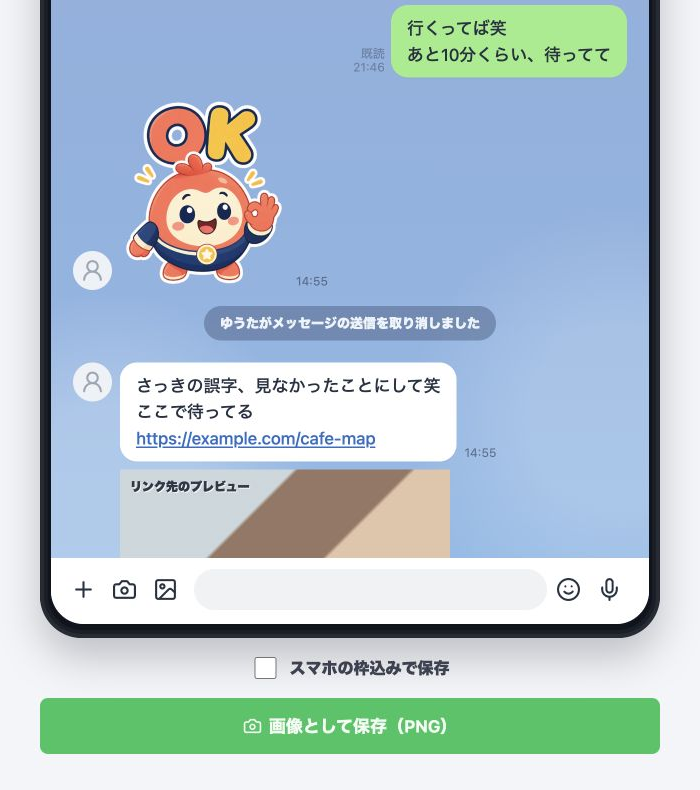

# 架空LINEトーク作成ツール

架空のLINE風トーク画像をブラウザだけで作成・編集し、PNG画像として保存できる静的Webアプリです。

## 公開URL

https://chro96.github.io/line-fake-chat-generator/

## サンプル画面



## Repository Description

架空のLINE風トーク画像をブラウザで作成・編集し、スタンプ風表示やPNG保存もできる静的Webアプリ

## 特徴

- インストール不要で、HTML/CSS/JavaScriptだけで動作します。
- 相手の名前、アイコン、背景画像、背景色、ステータスバー時刻を編集できます。
- 相手の発言、自分の発言、スタンプ、日付の区切り、通知メッセージを自由に追加できます。
- スタンプは透明背景のサンプル画像つきで追加でき、任意の画像をアップロードして差し替えできます。
- メッセージの編集、並べ替え、複製、削除ができます。
- URLを含むメッセージには、リンクプレビューカードを表示できます。
- 作成した内容はブラウザ内に自動保存されます。
- JSONでデータをエクスポート/インポートできます。
- スマホ枠あり/なしを選んでPNG保存できます。

## 起動方法

### すぐ開く

`index.html` をブラウザで開くと、そのまま使えます。

### ローカルサーバーで開く

ファイル選択やPNG保存を安定して使いたい場合は、ローカルサーバーで開く方法がおすすめです。

```sh
cd /Users/masa/projects/myProj/line-fake-chat-generator
python3 -m http.server 5173
```

ブラウザで次のURLを開きます。

```text
http://localhost:5173/
```

## 基本的な使い方

1. **全体設定を編集する**

   「相手の名前」「アイコン画像」「背景画像」「トーク背景色」「ステータスバーの時刻」を設定します。

2. **メッセージを追加する**

   「相手の発言」「自分の発言」「スタンプ」「日付の区切り」「通知」ボタンから、表示したい行を追加します。

3. **メッセージを編集する**

   メッセージ一覧の行をクリックすると、下の編集欄で種類と内容を変更できます。上下ボタンで順番を入れ替え、複製・削除もできます。

4. **スタンプを調整する**

   スタンプ行では、送信者、画像なしで表示する文字、任意のスタンプ画像、表示サイズを調整できます。新規スタンプには透明背景のサンプル画像が入ります。画像を削除した場合は、文字入りの簡易スタンプとして表示されます。

5. **URLプレビューを編集する**

   メッセージ本文にURLを入れると、URLプレビューカードの設定欄が表示されます。タイトル、説明、サムネイル画像、再生ボタンの有無を調整できます。

6. **プレビューを確認する**

   右側のスマホプレビューに、編集内容がリアルタイムで反映されます。

7. **PNG画像として保存する**

   「画像として保存（PNG）」を押すと、プレビューをPNGとして保存できます。「スマホの枠込みで保存」をオンにすると、端末フレーム込みで保存します。

## データの保存とバックアップ

編集内容はブラウザのローカルストレージに自動保存されます。同じブラウザで再度開くと、前回の内容を続きから編集できます。

別の環境へ移したい場合やバックアップしたい場合は、「JSONエクスポート」を使ってデータを保存してください。復元するときは「JSONインポート」から読み込みます。

## 注意事項

このアプリは架空のトーク画像作成用です。公開・共有時は、なりすまし、権利侵害、誤認を招く利用を避け、ご自身の責任でご利用ください。

## ファイル構成

```text
.
├── index.html
├── app.js
├── styles.css
├── assets/
│   └── sample-ok-sticker.png
└── README.md
```

## 開発メモ

このアプリは外部ライブラリを使わない静的アプリです。ビルド手順は不要で、ファイルを編集してブラウザを再読み込みすれば変更を確認できます。
